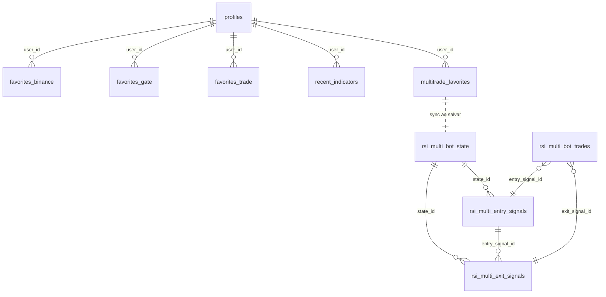
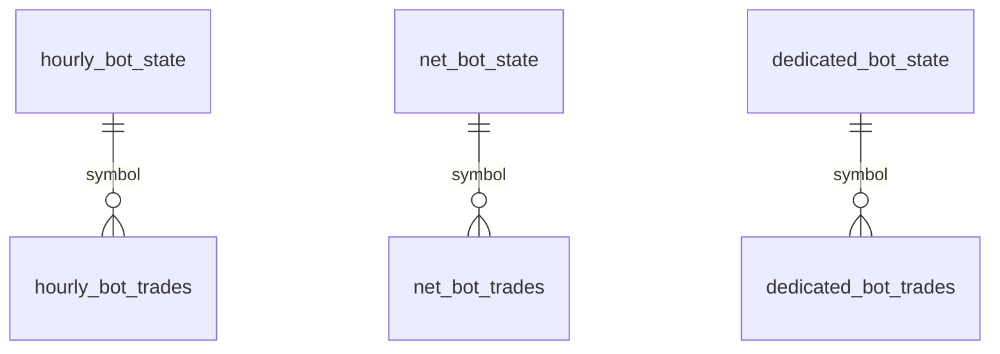

# Esquema do banco — lets-trade (Supabase / PostgreSQL)

Referência rápida para consulta rotineira.  
Scripts fonte: `supabase/schema.sql`, `backend/bot/amap/amap-bot.sql`, migrations em `supabase/`.

> Após `migration-simplify.sql`: `profiles.id` e todos os `user_id` são **TEXT** (single-user, sem Auth JWT obrigatório).  
> User padrão: `ueredeveloper` (`.env` → `SUPABASE_DEFAULT_USER_ID`).

---

## Mapa de relações



**Bots independentes** (sem FK para `profiles`):



---

## 1. App / Screener (UI)

### `profiles`
| Coluna | Tipo | Descrição |
|--------|------|-----------|
| `id` | TEXT PK | ID do usuário (`ueredeveloper` ou UUID como texto) |
| `email` | TEXT | E-mail |
| `is_admin` | BOOLEAN | Admin |
| `theme` | TEXT | `dark` \| `light` |
| `language` | TEXT | `pt-BR` \| `en-US` |
| `intervals` | TEXT[] | Intervalos do screener |
| `chart_interval` | TEXT | Intervalo padrão do gráfico |
| `created_at` | TIMESTAMPTZ | |
| `updated_at` | TIMESTAMPTZ | |

### `favorites_binance`
| Coluna | Tipo | Descrição |
|--------|------|-----------|
| `id` | BIGSERIAL PK | |
| `user_id` | TEXT FK → profiles | |
| `symbol` | TEXT | ex. `BTCUSDT` |
| `position` | INTEGER | Ordem na lista |
| `created_at` | TIMESTAMPTZ | |

**UNIQUE:** `(user_id, symbol)`

### `favorites_gate`
| Coluna | Tipo | Descrição |
|--------|------|-----------|
| `id` | BIGSERIAL PK | |
| `user_id` | TEXT FK → profiles | |
| `symbol` | TEXT | |
| `position` | INTEGER | |
| `gate_added` | BOOLEAN | Moeda adicionada via Gate (migration) |
| `created_at` | TIMESTAMPTZ | |

**UNIQUE:** `(user_id, symbol)`

### `favorites_trade` — bot Trade Now (RSI simples)
| Coluna | Tipo | Descrição |
|--------|------|-----------|
| `id` | BIGSERIAL PK | |
| `user_id` | TEXT FK → profiles | |
| `symbol` | TEXT | |
| `exchange` | TEXT | `gate` \| `binance` |
| `interval` | TEXT | Intervalo entrada RSI |
| `rsi_buy` | NUMERIC | Limiar compra (default 30) |
| `rsi_sell` | NUMERIC | Limiar venda (default 70) |
| `sell_interval` | TEXT | Intervalo saída (NULL = mesmo da entrada) |
| `variation_min` | NUMERIC | Variação mínima (opcional) |
| `position` | INTEGER | |
| `created_at` / `updated_at` | TIMESTAMPTZ | |

**UNIQUE:** `(user_id, symbol)`

### `recent_indicators`
| Coluna | Tipo | Descrição |
|--------|------|-----------|
| `id` | BIGSERIAL PK | |
| `user_id` | TEXT FK → profiles | |
| `key` | TEXT | Hash/chave da config (dedup) |
| `config` | JSONB | Config completa do indicador |
| `use_count` | INTEGER | Vezes usado |
| `last_used` | TIMESTAMPTZ | |

**UNIQUE:** `(user_id, key)`

---

## 2. Multi-Trade AMAP (principal)

### `multitrade_favorites` — configuração na UI
| Coluna | Tipo | Descrição |
|--------|------|-----------|
| `id` | UUID PK | |
| `user_id` | TEXT FK → profiles | |
| `symbol` | TEXT | |
| `exchange` | TEXT | `binance` \| `gate` |
| `strategy_id` | TEXT | Sempre `flex` (legado) |
| `capital` | NUMERIC | USDT alocado |
| **`trade_config`** | **JSONB** | **Fonte de verdade — todos os parâmetros AMAP** |
| `entry_rsi` | JSONB | Espelho legado `{interval, period, operator, value}` |
| `exit_rsi` | JSONB | Espelho legado |
| `ma_conditions` | JSONB | Espelho legado |
| `rule_3_candles` | BOOLEAN | Espelho legado |
| `rule_4_candles` | BOOLEAN | Espelho legado |
| `position` | INTEGER | |
| `created_at` / `updated_at` | TIMESTAMPTZ | |

**UNIQUE:** `(user_id, symbol)`  
**Ao salvar no painel:** sincroniza `rsi_multi_bot_state`.

### `rsi_multi_bot_state` — estado runtime do bot
| Coluna | Tipo | Descrição |
|--------|------|-----------|
| `id` | BIGSERIAL PK | Usado pelo bot em runtime |
| `symbol` | TEXT | |
| `exchange` | TEXT | |
| `strategy_id` | TEXT | `flex` |
| `initial_capital` | NUMERIC | Capital inicial |
| `capital` | NUMERIC | Capital atual (atualizado após cada trade) |
| **`phase`** | **TEXT** | **`WATCHING` \| `PENDING` \| `BOUGHT`** |
| **`trade_config`** | **JSONB** | Cópia da config (lida pelo bot) |
| `trigger_price` | NUMERIC | Preço gatilho (fase PENDING) |
| `trigger_rsi` | NUMERIC | RSI no gatilho |
| `limit_price` | NUMERIC | Alvo de compra (PENDING) |
| `pending_since` | TIMESTAMPTZ | Início do PENDING |
| `buy_price` | NUMERIC | Preço de compra (BOUGHT) |
| `buy_qty` | NUMERIC | Quantidade |
| `buy_usdt` | NUMERIC | USDT investido |
| `buy_time` | TIMESTAMPTZ | Hora da compra |
| `rsi_entry` | NUMERIC | RSI na entrada |
| `updated_at` | TIMESTAMPTZ | |

**UNIQUE:** `(symbol, strategy_id)`

### `rsi_multi_entry_signals` — funil de entrada
| Coluna | Tipo | Descrição |
|--------|------|-----------|
| `id` | BIGSERIAL PK | |
| `symbol` / `exchange` / `strategy_id` | TEXT | |
| `state_id` | BIGINT FK → rsi_multi_bot_state | |
| `detected_at` | TIMESTAMPTZ | |
| `candle_open_time` | TIMESTAMPTZ | |
| `price` | NUMERIC | Preço no sinal |
| `rsi_entry` / `rsi_exit` | NUMERIC | |
| `ma50` / `ma2` | NUMERIC | MAs no momento |
| `above_ma_pct` | NUMERIC | % acima da MA |
| **`status`** | **TEXT** | `detected` \| `blocked` \| `pending` \| `executed` \| `cancelled` |
| **`block_reason`** | **TEXT** | ex. `MA_BLOCKED`, `VOLUME_LOW`, `CANCELLED_TIMEOUT` |
| `trigger_price` / `limit_price` | NUMERIC | PENDING |
| `pending_since` / `pending_until` | TIMESTAMPTZ | |
| `executed_at` / `executed_price` / `executed_qty` / `executed_usdt` | | Compra executada |
| `immediate_entry` | BOOLEAN | |
| `trade_id` | BIGINT | FK lógica → rsi_multi_bot_trades |
| `metadata` | JSONB | |

### `rsi_multi_exit_signals` — funil de saída
| Coluna | Tipo | Descrição |
|--------|------|-----------|
| `id` | BIGSERIAL PK | |
| `symbol` / `exchange` / `strategy_id` | TEXT | |
| `state_id` | BIGINT FK | |
| `entry_signal_id` | BIGINT FK | |
| `signal_type` | TEXT | `rsi` \| `stop_loss` |
| `price` | NUMERIC | |
| `rsi_exit` | NUMERIC | |
| `stop_loss_ma` | NUMERIC | MA no stop |
| `buy_price` | NUMERIC | |
| `unrealized_pnl_pct` | NUMERIC | |
| `status` | TEXT | `detected` \| `executed` |
| `executed_*` | | Venda executada |
| `trade_id` | BIGINT | |
| `metadata` | JSONB | |

### `rsi_multi_bot_trades` — histórico fechado
| Coluna | Tipo | Descrição |
|--------|------|-----------|
| `id` | BIGSERIAL PK | |
| `symbol` / `exchange` / `strategy_id` | TEXT | |
| `entry_time` / `exit_time` | TIMESTAMPTZ | |
| `entry_price` / `exit_price` | NUMERIC | |
| `qty` | NUMERIC | |
| `usdt_in` / `usdt_out` | NUMERIC | |
| `pnl_usdt` / `pnl_pct` | NUMERIC | |
| `capital_before` / `capital_after` | NUMERIC | |
| `rsi_entry` / `rsi_exit` | NUMERIC | |
| **`exit_reason`** | **TEXT** | `rsi` \| `stop_loss_ma` |
| `duration_ms` | BIGINT | |
| `fee_usdt` | NUMERIC | |
| `entry_signal_id` / `exit_signal_id` | BIGINT | |
| `created_at` | TIMESTAMPTZ | |

### Views (criadas manualmente no Supabase)
| View | Uso |
|------|-----|
| `rsi_multi_timeline` | Timeline unificada entrada/saída (API `/multitrade-timeline`) |
| `rsi_multi_summary` | Resumo por símbolo |
| `rsi_multi_entry_funnel` | Funil de entradas |
| `rsi_multi_exit_funnel` | Funil de saídas |

---

## 3. Outros bots

### `hourly_bot_state` / `hourly_bot_trades`
Bot RSI 1h + EMA200. **UNIQUE:** `symbol` em state.

Campos extras em trades: `ema200`, `trend_bullish`.

### `net_bot_state` / `net_bot_trades`
Bot NET (RSI 1h, compra -3%, stop 3%). Fases: `WATCHING` \| `PENDING` \| `BOUGHT`.  
`exit_reason`: `RSI_SELL` \| `STOP_LOSS`.

### `dedicated_bot_state` / `dedicated_bot_trades`
Bot dedicado por moeda (EMA200 1h + RSI 5m).  
`symbol` pode ser `STGUSDT` ou `STGUSDT_GATE` (Gate.io).

---

## Consultas rotineiras

### Posições abertas (Multi-Trade)
```sql
SELECT symbol, exchange, phase, capital, buy_price, buy_qty, buy_time, updated_at
FROM rsi_multi_bot_state
WHERE phase = 'BOUGHT'
ORDER BY symbol;
```

### PENDING aguardando pullback
```sql
SELECT symbol, exchange, limit_price, trigger_price, pending_since
FROM rsi_multi_bot_state
WHERE phase = 'PENDING';
```

### Últimos trades Multi-Trade
```sql
SELECT symbol, entry_time, exit_time, pnl_usdt, pnl_pct, exit_reason, capital_after
FROM rsi_multi_bot_trades
ORDER BY exit_time DESC NULLS LAST
LIMIT 20;
```

### Config AMAP de um par
```sql
SELECT symbol, capital, trade_config
FROM multitrade_favorites
WHERE symbol = 'BTCUSDT';
```

### Sinais bloqueados hoje
```sql
SELECT symbol, status, block_reason, price, rsi_entry, detected_at
FROM rsi_multi_entry_signals
WHERE status = 'blocked'
  AND detected_at >= CURRENT_DATE
ORDER BY detected_at DESC;
```

### PnL total por símbolo
```sql
SELECT symbol,
       COUNT(*) AS trades,
       SUM(pnl_usdt) AS pnl_total,
       AVG(pnl_pct) AS pnl_medio_pct
FROM rsi_multi_bot_trades
GROUP BY symbol
ORDER BY pnl_total DESC;
```

### Favoritos Trade Now
```sql
SELECT symbol, exchange, interval, rsi_buy, rsi_sell, sell_interval
FROM favorites_trade
WHERE user_id = 'ueredeveloper';
```

---

## `trade_config` JSONB (estrutura)

Objeto persistido pelo painel Multi-Trade. Campos principais:

```json
{
  "entryRsi":  { "interval": "15m", "period": 14, "operator": "<", "value": 30 },
  "exitRsi":   { "interval": "15m", "period": 14, "operator": ">", "value": 70 },
  "maFilters": [ { "period": 50, "interval": "1h", "mode": "adaptive" } ],
  "extension": { "enabled": true, "maPeriod": 50, "maInterval": "1h", "abovePct": 5, "threeCandles": true, "fourCandles": true },
  "stopLoss":  { "enabled": true, "period": 50, "interval": "1h" },
  "immediateEntry": false,
  "entryDiscount": 0.001,
  "pendingTimeoutMs": 1800000,
  "minVolumeUsdt": 1000000,
  "pollMs": 60000,
  "fastPollMs": 30000
}
```

Código: `backend/bot/amap/tradeConfigSchema.js`

---

## Arquivos SQL no repositório

| Arquivo | Conteúdo |
|---------|----------|
| `supabase/schema.sql` | profiles, favorites_*, recent_indicators |
| `backend/bot/amap/amap-bot.sql` | tabelas Multi-Trade |
| `supabase/add-trade-config.sql` | coluna `trade_config` |
| `supabase/migration-simplify.sql` | single-user, TEXT ids, RLS off |
| `supabase/add-sell-interval.sql` | `favorites_trade.sell_interval` |
| `supabase/add-gate-added.sql` | `favorites_gate.gate_added` |
| `backend/bot/hourly/hourly-bot.sql` | hourly bot |
| `backend/bot/net/net-bot.sql` | net bot |
